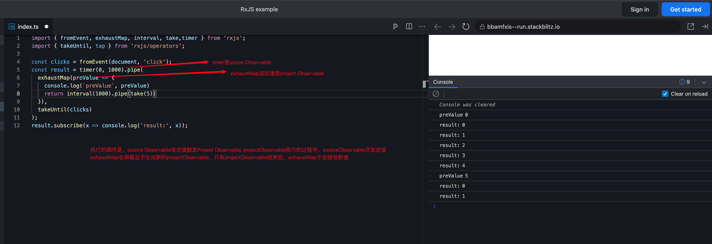

# rxjs

## 1. 常见用法

### concat

```js
// 顺序重要
// 创建两个observable
// 连接两个observable，concat的作用：第一个执行完才会执行第二个，第二个执行完才会触发complete
const firstObservable = of('First').pipe(
    delay(1000),
    map(value => ({ source: 'first', value }))
);
const secondObservable = of('Second').pipe(
    delay(1000),
    map(value => ({ source: 'second', value }))
);

const concatObservable = concat(firstObservable, secondObservable);
concatObservable.subscribe({
    next: result => {
        console.log(`Received value from ${result.source}: ${result.value}`);
    },
    complete: () => console.log('complete'),
});
```

### merge

```js
// 顺序不重要
// 创建并合并两个observable
// 两个谁先触发谁执行
import { merge } from 'rxjs/operators';
import { interval } from 'rxjs';

// 每2.5秒发出值
const first = interval(2500);
// 每1秒发出值
const second = interval(1000);
// 作为实例方法使用
const example = first.pipe(merge(second));
// 输出: 0,1,0,2....
const subscribe = example.subscribe(val => console.log(val));
```

### exhaustMap

```js
// source Observable 触发project Observable。在project Observable未结束之前，source Observable
// 的触发会被屏蔽
import { fromEvent, exhaustMap, interval, take, timer } from 'rxjs';
import { takeUntil, tap } from 'rxjs/operators';

const clicks = fromEvent(document, 'click');
// source Observable
const result = timer(0, 1000).pipe(
    // project Observable
    exhaustMap(preValue => {
        console.log(`preValue`, preValue);
        return interval(1000).pipe(take(5));
    }),
    takeUntil(clicks)
);
result.subscribe(x => console.log('result:', x));
```



## 2. 模拟请求写法标准化

```typescript
search$ = new BehaviorSubject(null);

// 固定调用业务无关，无需更改
ngOnInit() {
    this.search$
        .pipe(
            switchMap(() => {
                this.table.loading = true;
                return this.__getTableData().pipe(
                    finalize(() => (this.table.loading = false)),
                    filterSuccessResponse()
                );
            })
        )
        .subscribe(res => {
            const {data, total} = res as any;
            this.table.data = data;
            this.pg.total = total;
        });
}

// 请求对接业务相关，后续替换成真实请求即可（模拟请求过程）
__getTableData() {
    // ======TODO req======
    return new Observable(sub => {
        sub.next({
            data: Array(12).fill({ updateTime: '2025-04-23 10:23:12' }),
            total: 12,
            code: '0',
        });
        sub.complete();
    }).pipe(delay(2000));
}
```

