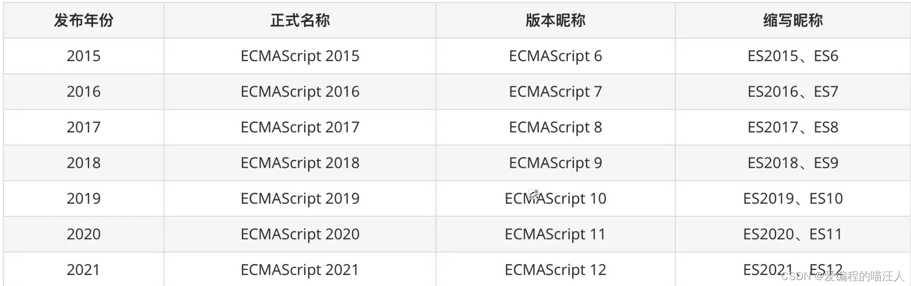
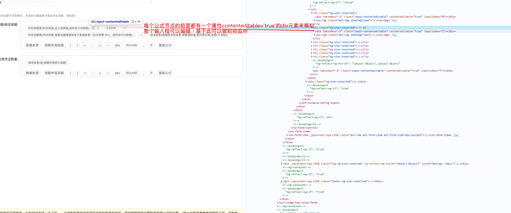

# js 基础

## ES version



## 1.基础概念

#### JS 中 == 和 === 区别是什么？

1. 对于 string,number 等基础类型，==和===有区别
    - 不同类型间比较，==之比较“转化成同一类型后的值”看“值”是否相等，===如果类型不同，其结果就是不等。
    - 同类型比较，直接进行“值”比较，两者结果一样。
2. 对于 Array,Object 等高级类型，==和===没有区别
    - 进行“指针地址”比较。
3. 基础类型与高级类型，==和===有区别
    - 对于==，将高级转化为基础类型，进行“值”比较。
    - 因为类型不同，===结果为 false。

#### slice & splice

1. 前者有两个可选参数，后者有三个参数（一个必填，两个可选）
2. 前者不修改原属组，后者修改原数组；
3. 前者截取数组中的某部分作为新数组返回；后者 1 个参数，表示截取数组中的 start 到最后的元素，并返回；后者 2 个参数，表示截取[start, start+step)的元素，并返回；后者 3 个参数，表示截取[start, start+step)的元素，并替换为第三个参数；

#### export & module.exports

1. 在没有修改的情况下`export === module.exports`;
2. export 其实指向的是 module.exports 的引用；
3. `export = {};`这是错误的写法，修改了 export 的引用，会导致无法正常导出，修改对象上的属性则不回导致这个问题；

#### 基本类型 & 引用类型

1. 基本类型保存在栈内存中，引用类型保存在堆内存中；
2. 基本类型：undefined, null, number, string, boolean, symbol; 引用类型：Object, Array, Function, Data, RegExp, Error；

#### 基本事件

1. contextmenu：鼠标的右击事件
    ```js
    window.document.addEventListener(
        'contextmenu',
        e => {
            e.preventDefault();
            console.log(e);
        },
        true
    );
    ```
2. drag：拖拽事件，当对某个元素进行拖拽监听（ondragstart）,想进行放置元素的时候需要对放置容器设置 ondrop 监听，同时需要对放置容器监听 ondragover 并且`e.preventDefault()`;􏷋􏳭􏷺􏼺􏻼􏳵􏸇􏴍􏺢􏺣􏼼􏻗􏵋􏳺􏴓􏵻􏳥􏴟􏴗􏳥􏳺􏴹􏵋􏳺􏴓􏵻􏴛􏴔􏳥􏳺􏻼􏳵􏳱􏴱􏴲􏸕􏵐􏴍􏼽􏷙􏻾􏳩􏵋􏳺􏴛􏳼􏻼􏳵􏳶
3. 获取选中的文本：
    ```js
    function getSelection() {
        window.getSelection ? window.getSelection().toString() : document.selection.createRange().text;
    }
    // 移除选中的文本
    document.getSelection().removeAllRanges();
    ```

#### 幂等操作

1. 如果一个事物不管是执行一次还是很多次，得到的结果都是相同的，那么该操作就是幂等；（http 请求的 get, head, delete, options, put, trace）

#### 宏任务和微任务

1. 宏任务：当前调用栈中执行的任务称为宏任务。（主代码快，定时器等等）。
2. 微任务： 当前（此次事件循环中）宏任务执行完，在下一个宏任务开始之前需要执行的任务为微任务。（可以理解为回调事件，promise.then，proness.nextTick 等等）。
3. 宏任务中的事件放在 callback queue 中，由事件触发线程维护；微任务的事件放在微任务队列中，由 js 引擎线程维护。

## 2.排序算法

> [link](https://www.cnblogs.com/onepixel/articles/7674659.html)

1. 冒泡

```js
const bubbleSort = arr => {
    const len = arr.length - 1;
    for (let i = 0; i < len; i++) {
        for (let j = 0; j < len - i; j++) {
            if (arr[j + 1] < arr[j]) {
                temp = arr[j + 1];
                arr[j + 1] = arr[j];
                arr[j] = temp;
            }
        }
    }
    return arr;
};
bubbleSort([9, 12, 8, 4, 5, 31, 12, 7]);
```

## 3.ES6 部分原理详解

#### Pormise

> 自己实现 promise；使用 es6 的 class

```js
// 极简的实现+链式调用+延迟机制+状态
class Promise {
    constructor(fn) {
        this.callbacks = [];
        this.state = 'pending'; // 增加状态
        this.value = null; // 保存结果
        fn(this._resolve.bind(this));
    }
    then(onFulfilled) {
        // 这里判断了调用then的时候，promise的状态（即resolve是否执行了），如果pending，则将函数放入调用栈，否则直接执行函数
        if (this.state === 'pending') {
            // 在resolve之前，跟之前逻辑一样，添加到callbacks中
            this.callbacks.push(onFulfilled);
        } else {
            // 在resolve之后，直接执行回调，返回结果了
            onFulfilled(this.value);
        }
        return this;
    }
    _resolve(value) {
        this.state = 'fulfilled'; // 改变状态
        this.value = value; // 保存结果
        this.callbacks.forEach(fn => fn(value));
    }
}
```

## 4.bind

> [link](https://www.webhek.com/post/javascript-bind.html)  
>  bind 返回的值是一个函数，并不会直接调用函数

`fun.bind(thisArg[, arg1[, arg2[, ...]]])`

-   thisArg 当绑定函数被调用时，该参数会作为原函数运行时的 this 指向。当使用 new 操作符调用绑定函数时，该参数无效。
-   arg1, arg2, … （可选）当绑定函数被调用时，这些参数加上绑定函数本身的参数会按照顺序作为原函数运行时的参数。

```js
// 利用apply实现原生浏览器的bind函数（低端浏览器不支持时候的hack）
Function.prototype.my_bind = function (context) {
    var fn = this;
    return function () {
        fn.apply(context, arguments);
    };
};
// 另外的实现
function bind(fn, context) {
    return function () {
        fn.apply(context, arguments);
    };
}
```

## 5.几句话能够说明的前端效果原理

1. 水印(参考 naiveUI)
    - 利用水印元素`position:fixed;pointer-event: none;`的样式事项,`pointer-event:none;`会自动鼠标事件穿透; 水印可以用`canvas`绘图文,然后`canvas.toDataURL()`

## 奇奇怪怪的函数

-   利用`a.b.c.e`创建嵌套对象
    ```js
    function createObj(str) {
        var o = (p = g = {});
        var parts = str.split('.');
        for (var i = 0; i < parts.length; i++) {
            if (!p[parts[i]]) {
                p[parts[i]] = {}; // 第一次这里的地址引用实际是g，所以修改的是g
            }
            old = p;
            p = p[parts[i]];
        }
        return g;
    }
    ```
-   利用上面的函数原理创建模块定义函数（JS 设计模式中的同步模块模式）[javaScript 设计模式 p256]()

```js
var F = F || {};
F.define = function (str, fn) {
    var o = (p = this);
    var parts = str.split('.');
    var i = 0;
    for (; i < parts.length; i++) {
        if (!p[parts[i]]) {
            p[parts[i]] = {};
        }
        o = p;
        p = p[parts[i]];
    }
    if (fn) o[parts[--i]] = fn();
    return this;
};
// 定义模块/注册模块
// F.define('a.b.c.d.e', function() {
//     return function(){
//         console.log(9999)
//     }
// })
```

-   模块的调用[javaScript 设计模式 p258]()

```js
F.module = function () {
    var args = [].slice.call(arguments),
        fn = args.pop(),
        parts = args,
        pl = parts.length,
        i = 0,
        p,
        ms = [];
    while (i < pl) {
        if (parts[i].constructor == String) {
            var modules = parts[i].split('.');
            p = this;
            for (var j = 0; j < modules.length; j++) {
                p = p[modules[j]] || false;
            }
            ms.push(p);
        } else {
        }
        i++;
    }
    fn.apply(null, ms);
};
// 调用模块
// F.module('a.b.c.d.e', function(e) {
//     e()
// })
```

## 6.框架实现 theme 切换

-   实现一 [elementUI 实现方式]()  
    项目仓库在这：[link](https://github.com/ElementUI/theme-preview)实现其实很暴力：
    先把默认主题文件中涉及到颜色的 CSS 值替换成关键词：[link](https://github.com/ElementUI/theme-preview/blob/master/src/app.vue#L250-L274)  
    根据用户选择的主题色生成一系列对应的颜色值：[link](https://github.com/ElementUI/theme-preview/blob/master/src/utils/formula.json)  
    把关键词再换回刚刚生成的相应的颜色值：[link](https://github.com/ElementUI/theme-preview/blob/master/src/utils/color.js)  
    直接在页面上加 style 标签，把生成的样式填进去：[link](https://github.com/ElementUI/theme-preview/blob/master/src/app.vue#L198-L211)
-   实现二[antd 实现方式](https://github.com/jyzwf/blog/issues/70)
    > another article: [atricle1](https://github.com/1019483075/lingxi/issues/26)

## 7.webpack

[link](https://github.com/1019483075/lingxi#Vue%E6%98%AF%E5%A6%82%E4%BD%95%E5%B7%A5%E4%BD%9C%E7%9A%84%E7%B3%BB%E5%88%97)

-   webpack 的 publicPath[link](urlhttps://www.cnblogs.com/SamWeb/p/8353367.html)
    -   publicPath 在 webpack-dev-server 的时候指定的是打进 RAM 的文件的位置
    -   publicPath 在 npm run build 的时候是所有的 url 文件的前缀

## 8.js 对象的自有属性和继承属性

```js
// scheme1
function Point(x, y) {
    this.x = x;
    this.y = y;
    this.toString = function () {
        console.log(`${this.x},${this.y}`);
    };
}
// scheme2
function Point1(x, y) {
    this.x = x;
    this.y = y;
}
Point1.prototype.toString = function () {
    console.log(`${this.x},${this.y}`);
};

// scheme3
class Point2 {
    x = 0;
    y = 0;
    constructor(x, y) {
        this.x = x;
        this.y = y;
    }
    toString() {
        console.log(`${this.x},${this.y}`);
    }
}
```

> scheme1 定义的 toString 方法可以通过`Object.getOwnPropertyDescriptors`查看
> scheme2 定义的 toString 方法无法通过该方法查看到
> scheme3 定义的 toString 方法是在`Point2.__proto__`上的且`enumerable: false`

## 9.特殊的表达式调用

[link](https://blog.csdn.net/qq_39446719/article/details/103838706)

(0,function)(p1,p2)

## 10.复制粘贴能力

| 特性             | navigator.clipboard.readText()           | event.clipboardData.getData('text')           |
| ---------------- | ---------------------------------------- | --------------------------------------------- |
| 调用时机         | 可主动调用（程序控制）                   | 只能在 paste 事件回调中使用                   |
| 是否需要用户手势 | ✅ 必须由用户交互触发（如 click）        | ✅ 用户必须执行粘贴操作（Ctrl+V 等）          |
| 协议要求         | 🔒 仅限 安全上下文（HTTPS 或 localhost） | ✅ 任何协议都支持（HTTP、localhost、file://） |
| 是否需要授权     | ⚠️ 部分浏览器会弹出权限请求              | ❌ 无需授权（用户粘贴即视为授权）             |
| 能否后台读取     | ❌ 不能（需用户手势）                    | ❌ 不能（需用户粘贴）                         |
| 浏览器兼容性     | Chrome 66+、Firefox 63+、Safari 13.1+    | 所有现代浏览器 + IE9+                         |
| 典型用途         | “点击按钮读取剪贴板”                     | “监听用户粘贴内容”                            |

```js
document.onpaste = (event: any) => {
    try {
        const copyText = event.clipboardData.getData('text');
    } catch (error) {
    }
};
```
### 10.1实现公式编辑器
