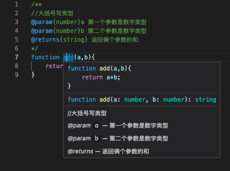

# 代码规范

## 注释相关
1. 代码注释解释的应该是why问题，而不是what问题
2. 良好的代码具有‘自我解释’功能，能够解决what问题
3. 注释解决why问题，告诉读者代码为什么这么写
4. 与其纠结如何写好注释，不如先考虑先把代码写好
5. 不必要的地方不要写注释
6. 功能复杂的函数拆分成功能单一的小函数
> tips:其实写代码注释要根据具体的情况来定，但是最好根据以上的原则来进行

## 函数注释  
```js
/**
//大括号写类型
@param {number}a 第一个参数是数字类型
@param {number}b 第二个参数是数字类型
@returns {string} 返回俩个参数的和
*/
function add(a,b){
    return a+b;
}
```

