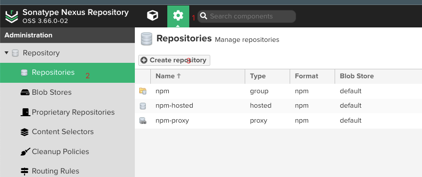
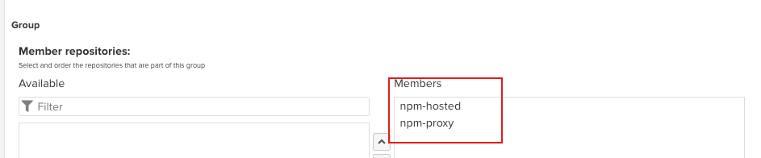
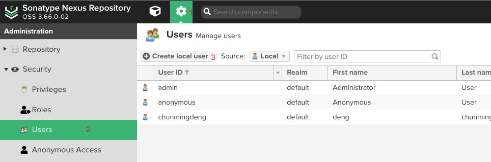
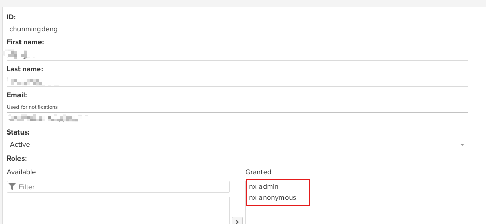

# repository
> node js repository
---
## 私有仓库
> 公司或个人持有node package的私有仓库

### [nexus](https://www.sonatype.com/thanks/repo-oss)

> 支持多种仓库，不限于npm、maven\
[ChangeLogs](https://help.sonatype.com/en/milestone-releases.html)\
[home](https://www.sonatype.com/)\
[download address](https://www.sonatype.com/thanks/repo-oss)


::: tabs

@tab 1.java8安装
1. 通过brew直接下载
2. 通过安装包安装

:::warning
nexus3需要安装jdk8

@tab 2.配置nexus3的启动配置
以`nexus-3.66.0-02-mac`为例\
1. 编辑`nexus-3.66.0-02-mac/nexus-3.66.0-02/bin/nexus`可执行文件，指定`INSTALL4J_JAVA_HOME_OVERRIDE="/Library/Java/JavaVirtualMachines/zulu-8.jdk/Contents/Home"`其中的地址是jdk在本机的安装home地址
2. `cd /Users/chunmingdeng/Downloads/nexus-3.66.0-02-mac/nexus-3.66.0-02/bin`切换到nexus下的bin目录
3. `$./nexus start` 通过脚本文件执行start命令 （start|stop|reload）
4. 此时服务已经能够访问了，默认访问端口查看`/nexus-3.66.0-02-mac/nexus-3.66.0-02/etc/nexus.properties`文件，默认密码查看`nexus-3.66.0-02-mac/sonatype-work/nexus3/admin.password `
:::tip
`./nexus start`是没有启动日志的，后台运行;\
`./nexus run`有启动日志，两者的最终效果是相同的;

@tab 3.nexus新建仓库
1. 新建group,hosted,proxy三个类型的仓库，proxy用来代理访问外部仓库并缓存已访问过的仓库，hosted用来作为私有仓库使用（push代码的时候必须直接指定为这个仓库），group是作为安装npm依赖的时候使用的仓库，会自动访问hosted|proxy
2. 在新建group仓库后，要将hosted&proxy两个仓库设置为其成员仓库

@tab 4.nexus新建账号
1. 根据步骤打开新建账号页面
2. 依次填写账号信息，然后把要授权的仓库移至右边

@tab 5.如何使用
1. 切换到要进行发布的项目下，这里假使项目文件为`example/`，将文件夹下`package.json`的`private: true`设置为`false`;
2. 切换到打包好要发布的文件夹下`example/dist`，如果dist/package.json的private也设置为false；
3. 创建`.npmrc`文件，指定仓库地址，这个地址是`npm install`使用的
    ```.npmrc
    # 这里使用的是一个本地nexus为例
    registry=http://localhost:8081/repository/npm/
    ```
4. 在命令行输入`npm login`，使用创建的账号进行登陆，然后这时候就可以使用`npm publish`发布包了
:::


### verdaccio
> 自身就是一个npm包