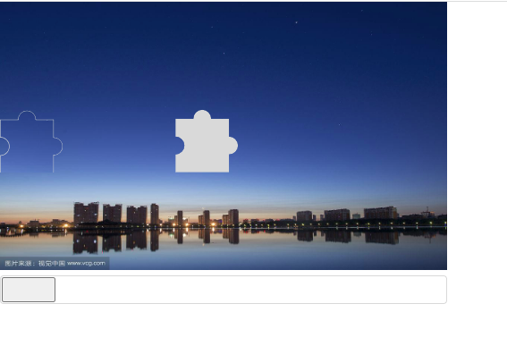

# 滑动校验插件

## Documents
- 创建实例
  ```ts
  interface IOptions {
    width: number; // 容器宽度
    hegiht: number; // 容器高度
    clipWidth: number; // 小图片宽高，如果不设置，是width * 0.1且范围区间为[30, 80]
  }
  new SlideVerify(id: string, options: IOptions);
  ```

- 监听滑动校验结果
  ```typescript
  // 监听valid事件
  ins.on('valid', (v: boolean) => {
    console.log('valid value', v)
    if(!v) ins.reload();// 校验失败，可以选择重新生成位置，调用reload函数
  })
  ```
- 重置刷新图片
  ```typescript
  ins.reload();// 校验失败，可以选择重新生成位置，调用reload函数
  ```


## usage
```vue
<script setup>
  let ins = new SlideVerify('slide-verify', {
    height: 100,
    width: 160,
    clipWidth: 50,
  });
  // 拖拽放开触发校验，校验之后的callbck
  ins.on('valid', (v) => {
    console.log('valid value', v)
    if(!v) ins.reload();// 校验失败，可以选择重新生成位置，调用reload函数
  })

  let ins01 = new SlideVerify('slide-verify01', {
    height: 200,
    width: 260,
    clipWidth: 150,
  });
  ins01.on('valid', (v) => {
    console.log('valid value', v)
    if(!v) ins01.reload();
  })

  let ins02 = new SlideVerify('slide-verify02', {
    height: 600,
    width: 960
  });
  ins02.on('valid', (v) => {
    console.log('valid value', v)
    if(!v) ins02.reload();
  })
</script>
  
<template>
  <div id="slide-verify" style="height: 300px; width: 500px; position: relative; display: flex; justify-content: center; align-items: center;">
  </div>
  <div id="slide-verify01" style="height: 300px; width: 500px; position: relative; display: flex; justify-content: center; align-items: center;">
  </div>
  <div id="slide-verify02" style="height: 700px; width: 1000px; position: relative; display: flex; justify-content: center; align-items: center;">
  </div>
</template>
```

## 效果


## 源码
```js
export default class SlideVerify {
  opt = {
    height: 300, 
    width: 500, 
    clipWidth: 70, 
    imgBorderWidth: 2
  };
  root_el = null;
  canvas = null;
  ctx = null;
  img = null;
  slideBar = null;
  slideBtn = null;

  eventStack={};

  constructor(id, opt = {}) {
    const container = document.getElementById(id);
    this.root_el = document.createElement('div');
    this.root_el.id = `slide-verify-${Date.now()}`
    this.root_el.style.cssText = 'position: relative; display: inline-block;'
    this.opt = this.processOpt(opt);
    this.generateCanvasImg();
    this.generateImg().then(r => this.img.src = r)
    this.generateSlideBar()
    container.append(this.root_el)
    return this;
  }

  processOpt(opt) {
    if (opt.height && opt.width && !opt.clipWidth) {
      let m = opt.width * 0.1;
      m = m < 80 ? m : 80;
      m = m > 30 ? m : 30;
      opt.clipWidth = m;
    }
    if (!opt.r) {
      opt.r = opt.clipWidth / 6;
    }
    let r = Object.assign(this.opt, opt)
    this.opt.ox = Math.random() * (this.opt.width - this.opt.clipWidth); 
    this.opt.oy = Math.random() * (this.opt.height - this.opt.clipWidth);
    return r;
  }

  paintPath(ctx) {
    let opt = this.opt;
    const ox = opt.ox;
    const oy = opt.oy;
    let {x, y} = {x: ox, y: oy} // 图片的初始位置
    let {w, h} = {w: opt.clipWidth, h: opt.clipWidth} // 图片的宽高
    const r = opt.r; // 圆弧半径
    const d = (w - 3 * r) / 2;
    ctx.beginPath();
    y += r;
    ctx.moveTo(x, y)
    x += d;
    ctx.lineTo(x, y)
    x += r;
    ctx.arc(x, y, r,  Math.PI, 0, false)
    x += r + d;
    ctx.lineTo(x, y)
    y += d;
    ctx.lineTo(x, y)
    y += r;
    ctx.arc(x, y, r, -Math.PI/2, Math.PI/2, false)
    y += r + d;
    ctx.lineTo(x, y)
    x -= d * 2 + r * 2;
    ctx.lineTo(x, y)
    y -= d;
    ctx.lineTo(x, y)
    y -= r;
    ctx.arc(x, y, r, Math.PI/2, -Math.PI/2, true)
    ctx.closePath();
    x = ox;
    y = oy;
    return {
      x, y, w, h, r, d
    }
  }

  generateCanvasImg() {
    this.canvas = document.createElement('canvas');
    this.canvas.height = this.opt.height;
    this.canvas.width = this.opt.width;
    this.canvas.style.cssText = 'position: relative; top: 0; left: 0;'
    this.ctx = this.canvas.getContext('2d');
    this.canvas.id = 'canvas'
    let ctx = this.ctx;
    let img = new Image();
    img.onload = _ => {
      ctx.drawImage(img, 0, 0, img.width, img.height, 0, 0, this.opt.width, this.opt.height)
      this.paintPath(ctx);
      ctx.lineWidth = this.opt.imgBorderWidth;
      ctx.strokeStyle = '#d9d9d9'
      ctx.stroke();

      ctx.clip();
      ctx.fillStyle = '#d9d9d9'
      ctx.fill()
    }
    img.src = '/a.png';
    
    this.root_el.appendChild(this.canvas)
  }

  generateImg() {
    this.img = document.createElement('img');
    this.root_el.appendChild(this.img)
    this.canvas.height = this.opt.height;
    this.canvas.width = this.opt.width;

    this.img.style.cssText = `height: ${this.opt.clipWidth}px; width: ${this.opt.clipWidth}px; position: absolute; top: ${this.opt.oy}px;left: 0;`;

    const canvas = document.createElement('canvas')
    canvas.height = this.opt.height;
    canvas.width = this.opt.width;
    const ctx = canvas.getContext('2d');
    let img = new Image();
    let p = new Promise((resolve, reject) => {
      img.onload = _ => {
        const {x, y, w, h, r, d} = this.paintPath(ctx);
        ctx.strokeStyle = '#d9d9d9';
        ctx.lineWidth = this.opt.imgBorderWidth;
        ctx.stroke();
        ctx.clip();
        ctx.drawImage(img, 0, 0, img.width, img.height, 0, 0, this.opt.width, this.opt.height)
        let canvas_m = document.createElement('canvas')
        let ctx_m = canvas_m.getContext('2d');
        canvas_m.height = h + 2 * this.opt.imgBorderWidth;
        canvas_m.width = w + 2 * this.opt.imgBorderWidth;
        let imgdata = ctx.getImageData(this.opt.ox - this.opt.imgBorderWidth, 
          this.opt.oy - this.opt.imgBorderWidth, 
          this.opt.ox + this.opt.clipWidth + this.opt.imgBorderWidth, 
          this.opt.oy + this.opt.clipWidth + this.opt.imgBorderWidth);
        ctx_m.putImageData(imgdata, 0, 0)
        resolve(canvas_m.toDataURL('image/png', 1))
      }
    })
    img.src = '/a.png';
    return p;
  }

  generateSlideBar() {
    let height = this.opt.clipWidth * 0.6;
    height = height > 32 ? 32 : height;
    this.slideBar = document.createElement('div');
    this.slideBar.id = 'slide-bar';
    this.slideBar.style.cssText = `border: 1px solid #d9d9d9; border-radius: 4px; height: ${height + 4}px; width: ${this.opt.width}px;position: relative`
    this.root_el.appendChild(this.slideBar)
  
    this.slideBtn = document.createElement('button');
    this.slideBtn.id = 'slid-btn';
    this.slideBtn.style.cssText = `height: ${height}px; width: ${this.opt.clipWidth}px; position: absolute; top: 1px; left: 1px; cursor: pointer;`
    this.slideBtnBindEvent()
    this.slideBar.appendChild(this.slideBtn);
  }

  slideBtnBindEvent() {
    let el = this.slideBtn;
    let opt = this.opt;
    el.onmousedown = (e) => {
      let {x, y} = {x: e.clientX, y: e.clientY};
      el.onmousemove = e => {
        let diffx = e.clientX - x;
        let left = (1 + diffx) > 1 ? 1 + diffx : 1;
        left = left < Number.parseInt(getComputedStyle(el.parentNode).width) - Number.parseInt(getComputedStyle(el).width) - 3 
        ? left 
        : Number.parseInt(getComputedStyle(el.parentNode).width) - Number.parseInt(getComputedStyle(el).width) - 2
        el.style.left = left + 'px';
        this.img.style.left = left + 'px';
      }
    }
    el.onmouseup = () => {
      let diff = Number.parseInt(this.img.style.left) - this.opt.ox;
      let r = (diff > -5 && diff < 5) ? true : false;
      if (r) {
        el.style.backgroundColor = '#7bed9f';
        el.style.borderColor = 'transparent'
      } else {
        el.style.backgroundColor = '#ff4757';
        el.style.borderColor = 'transparent'
      }
      this.emit('valid', r)
      el.onmousemove = null;
    }
  }
  
  reload() {
    this.root_el.innerHTML = '';
    this.generateCanvasImg()
    this.generateImg().then(r => this.img.src = r)
    this.generateSlideBar()
  }

  on(eventName, callback) {
    if (!this.eventStack.eventName) {
      this.eventStack[eventName] = [callback];
    } else {
      this.eventStack[eventName].push(callback)
    }
  }
  emit(eventName, p) {
    if(this.eventStack[eventName]) {
      this.eventStack[eventName].forEach(callback => {
        callback(p);
      })
    }
  }
}
```