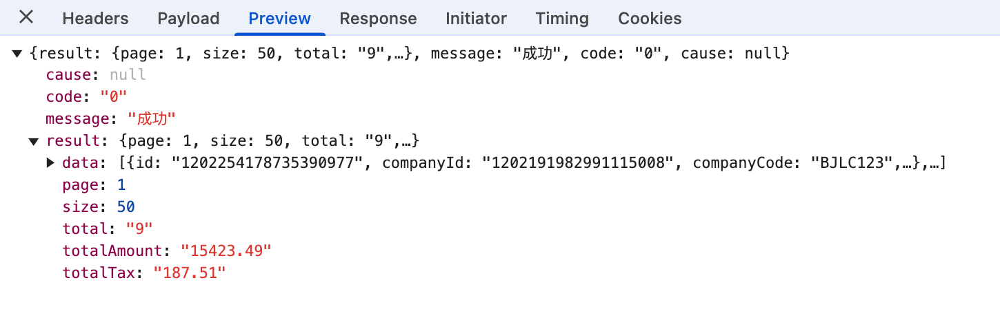

# 关于互算清缴服务引伸出来的相关知识分享主题会议


## 1 息息相关的http请求

### 1.1 请求构成

1. 请求行（Request Line），定义了请求的基本信息。
2. 请求头（Request Headers），提供了关于请求的元信息。
3. 请求体（Request Body），携带了实际的数据。

### 1.2 请求行

1. 请求格式

```js
// <method> <request-target> <http-version>
GET /api/data HTTP/1.1
```

2. url（Uniform Resource Locator，统一资源定位符）即上面的`<request-target>`

```js
scheme://userinfo@host:port/path?query#fragment
各部分说明：
scheme：协议类型。
userinfo：用户信息（可选）。
host：主机名或 IP 地址。
port：端口号（可选，默认为协议默认端口）。
path：资源路径。
query：查询参数（可选）。
fragment：片段标识符（可选）。
```

### 1.3 响应头


### 1.4 响应体



## 2 什么是前端服务

> 一般情况下，前端服务就是一个静态文件服务器，这个服务支持访问静态文件；当浏览器发起请求的时候，`前端服务`返回对应的资源。页面就是浏览器解析前端服务返回的html+js+css内容所渲染出来的。

### 2.1 前端服务的搭建方式

1. 基于nodejs的express，koa等框架可以快速搭建静态文件服务，配置好路由即可。
2. 基于nginx，nginx本身支持静态文件，只需配置好nginx配置文件即可。
3. 其它（不考虑）

### 2.2 nginx正向代理反向代理
1. 正向代理（Forward Proxy）

  > 定义：正向代理是指客户端通过代理服务器访问外部网络资源。客户端将请求发送到代理服务器，代理服务器再将请求转发到目标服务器，并将响应返回给客户端。
  >
  > > ***应用场景***
  > > 内网用户通过代理服务器访问外网资源。
  > > 隐藏客户端的真实 IP 地址。
  > > 实现缓存加速或内容过滤。

2. 反向代理（Reverse Proxy）

  > 定义：反向代理是指客户端直接访问代理服务器，代理服务器将请求转发到后端服务器，并将后端服务器的响应返回给客户端。客户端不知道后端服务器的存在。
  >
  > > ***应用场景***
  > > 负载均衡：分发流量到多个后端服务器。
  > > 隐藏后端服务器的真实 IP 地址。
  > > 提供缓存加速、SSL 终止等功能。
  > > 统一入口管理，简化 URL 结构。

3. 正向代理&反向代理的区别

  | 特性           | 正向代理                         | 反向代理                         |
  | -------------- | -------------------------------- | -------------------------------- |
  | **客户端感知** | 客户端知道代理服务器的存在       | 客户端不知道后端服务器的存在     |
  | **主要用途**   | 访问外部网络资源                 | 保护和优化后端服务器             |
  | **流量方向**   | 客户端 → 代理服务器 → 目标服务器 | 客户端 → 代理服务器 → 后端服务器 |
  | **典型场景**   | 内网访问外网，隐藏客户端 IP      | 负载均衡，统一入口管理           |

### 2.3 通过nginx搭建一个简单前端服务（反向代理的一种应用）

1. nginx配置

   

2. [示例url](http://localhost:6001/blog/nginx/start.html#nginx-conf%E6%96%87%E4%BB%B6%E9%85%8D%E7%BD%AE%E5%9F%BA%E7%A1%80%E7%BB%93%E6%9E%84)


## 3 服务访问问题

### 3.1 cookie写入问题

1. 父页面a a.com；子页面b b.com；

   - [x] 当页面a通过iframe嵌套页面b，b页面中有一段代码是给b.com域名写入cookie，是否能写入？

   - [x] 在上述前提下，b.com域名下存在cookie，b页面发送请求http://b.com开始的请求，cookie是否会自动带上？


2. 解决方案：
   1. header token
   2. url token
   3. 公共域名
   4. https cookie secure

### 3.2 跨域问题

> 前端跨域是一个常见的问题，通常发生在浏览器尝试从一个源（origin）访问另一个源的资源时。由于浏览器的安全策略（同源策略），只有当协议、域名和端口号完全一致时，才被认为是同源。否则，就会触发跨域限制。

1. 出现跨域的情况

   1. 协议不同
   2. 域名不同
   3. 端口号

2. 解决方案

   1. 本机环境，本地开发代理机制（无需后端改造）；

      ```json
      // angular proxy.conf.json
      {
        "/api/*": {
          "target": "http://workbench.fat.yzf.net",
          "sercure": false,
          "logLevel": "debug",
          "changeOrigin": true
        },
        "/web/*": {
            "target": "http://report.yunzhangfang.com:8080",
            "secure": false,
            "logLevel": "debug",
            "changeOrigin": true
        }
      }
      ```


   2. 线上环境，服务器代理机制；

      ```nginx
      # nginx代理配置

      upstream yzf {
          server report.yunzhangfang.com;
      }

      server {
          listen       18801;
          server_name  yzf;
          location /api {
              #CORS 配置
              add_header 'Access-Control-Allow-Origin' 'http://report.yunzhangfang.com';
              add_header 'Access-Control-Allow-Methods' 'GET, POST, OPTIONS, PUT, DELETE';
              #是否允许cookie传输
              add_header 'Access-Control-Allow-Credentials' 'true';
              add_header 'Access-Control-Allow-Headers' 'X-Requested-With,Authorization,Content-Type,Accept,Origin,User-Agent';

              #针对浏览器的options预请求直接返回200，否则会被403 forbidden--invalie CORS request
              if ( $request_method = 'OPTIONS' ) {
                      return 200;
              }
              proxy_pass http://workbench.fat.yzf.net/;
          }
      }
      ```


   3. 本机+线上，服务端允许跨域；

      ```js
      // nodejs koa
      const Koa = require('koa');
      const app = new Koa();

      app.use(async (ctx, next) => {
        ctx.set('Access-Control-Allow-Origin', '*');
        ctx.set('Access-Control-Allow-Headers', 'Content-Type, Content-Length, Authorization, Accept, X-Requested-With');
        ctx.set('Access-Control-Allow-Methods', 'PUT, POST, GET, DELETE, OPTIONS');
        if (ctx.method == 'OPTIONS') {
          ctx.body = 200;
        } else {
          await next();
        }
        console.log(ctx)
        const clientIp = ctx.request.header['X-Forwarded-For'];
        ctx.body = `Your IP address is ${clientIp}`;
      });

      app.listen(3000);
      ```


      


## 附注

### 1 spreadjs

1. spreadjs是一个第三方库，主要是用来做表格渲染的；
2. spreadjs本地localhost部署服务没有证书限制（非localhost需要购买管方证书）；

#### 1.1 未获得license证书的域名如何访问已有的spreadjs的服务

> 前提已经有一个可以使用的域名证书了

1. 18801端口，公司内部环境访问，走公司网关代理

2. 18802端口，公司外部本地化项目访问，走公司网关代理，回调本地化项目接口


